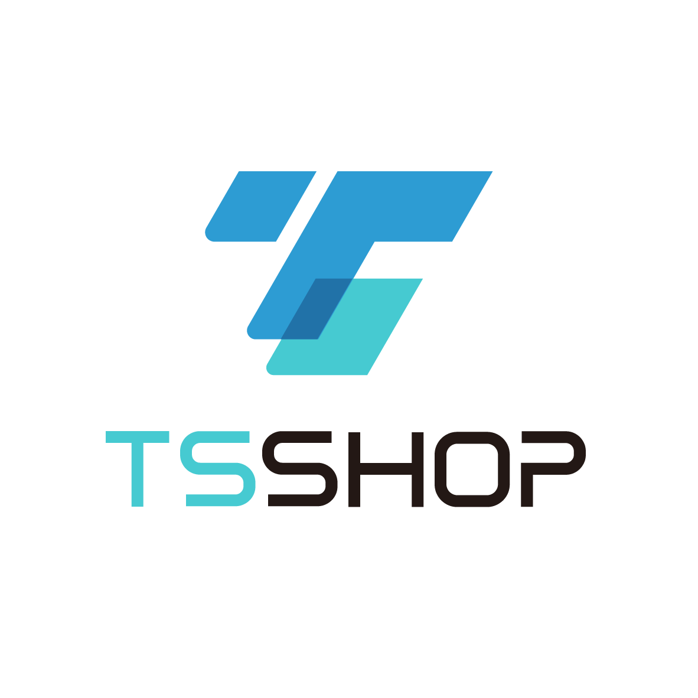

一个基于vue、element ui 的轻量级、前后端分离、拥有完整商城流程且具备直播和多支付的开源商城。

## 前言

`TSshop开源商城`项目致力于为中小企业打造一个完整、易于维护的开源的电商系统，采用现阶段流行技术实现。后台管理系统包含商品管理、订单管理、直播管理、支付管理、权限管理、设置等模块。

## 项目链接

java后台：

vue中后台：

uniapp：

## 项目特点

TSshop开源商城 不同于普通商城项目，该商城基于uniapp开发，具有完善的多支付功能和直播功能，并且抽离了许多项目配置，如支付管理、提现设置、小程序设置、快递设置、协议设置、储存设置、短信设置等，配置抽离让这些配置操作不再复杂，仅在后管理中就可配置完成相关功能。

## 相关截图

## 提交反馈

提问之前，请先阅读[提问的智慧](https://github.com/ryanhanwu/How-To-Ask-Questions-The-Smart-Way/blob/master/README-zh_CN.md)：

- 开源商城交流QQ群：856292894

  

